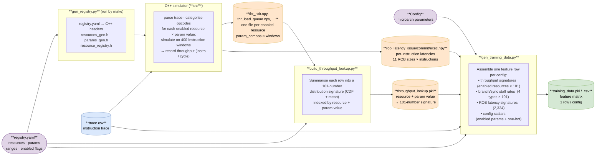

# Training Data Pipeline

The goal is to produce a feature matrix that a ML model can train on to predict processor performance. Each row in the matrix corresponds to one microarchitecture configuration; the columns are numerical features that describe (a) how that configuration would handle the workload and (b) properties of the workload itself.

## Data Flow



**Legend**

| Shape / colour | Meaning |
|---|---|
| Cylinder, blue | Input data file |
| Cylinder, orange | Intermediate data file |
| Cylinder, green | Final output |
| Rounded rect, purple | Runtime parameter (not a file on disk) |
| Subgraph | Code / script |

---

## Step 1 — C++ simulator (`src/`): generating throughput tables

The C++ simulator (`src/parser.cpp` → `src/models.cpp`) reads and categorises the trace, then models each hardware resource in isolation. For each resource it asks: *"given this many parallel slots / this queue depth, how many instructions per cycle can this window of code sustain?"*

### What is a trace?

`trace.csv` is a record of every instruction executed by a program, in order. Each row contains the instruction's type, memory address (for loads/stores), branch information, and execution latency. The simulator reads this file and replays it analytically — no real hardware is needed.

### Parameter sweep

The simulator does not model one fixed microarchitecture. Instead, for each resource it sweeps a range of parameter values (powers of 2) so the resulting data covers the whole design space. Resources that depend on two parameters get the full cartesian product.

| Resource | Parameter(s) swept | Range | # values |
|---|---|---|---|
| Reorder Buffer (ROB) | rob_size | 1 – 1024 | 11 |
| Load Queue | load_queue_size | 1 – 256 | 9 |
| Store Queue | store_queue_size | 1 – 256 | 9 |
| ALU issue slots | alu_issue_width | 1 – 8 | 4 |
| ALU multiply slots | alu_mul_issue_width | 1 – 8 | 4 |
| ALU divide slots | alu_div_issue_width | 1 – 8 | 4 |
| FP issue slots | fp_issue_width | 1 – 8 | 4 |
| Load/store issue slots | ls_issue_width | 1 – 8 | 4 |
| Load & load/store pipes | num_ls_pipes × num_load_pipes | 1–8 × 0–8 | 4 × 5 = 20 |
| I-cache fill buffers | max_icache_fills | 1 – 32 | 6 |
| Fetch buffers | num_fetch_buffers | 1 – 8 | 4 |

### Window sliding

The trace is split into non-overlapping 400-instruction windows. For each `(resource, parameter value)` pair, the simulator evaluates every window independently and records `instructions / cycles` as a throughput sample.

### Output

Each resource produces a 2-D `.npy` file:

```
rows  = parameter values  (from the sweep above)
cols  = trace windows     (≈ len(trace) / 400)
value = throughput        (instructions per cycle)
```

A separate ROB latency pass records per-instruction issue, execution, and commit latencies for 11 ROB sizes (powers of 2 from 1 to 1024).

---

## Step 2 — `build_throughput_lookup.py`: compressing tables into signatures

A raw throughput table has one number per window, but the number of windows varies by trace length. To get a fixed-size, trace-length-independent representation, each row is compressed into a **101-number distribution signature**:

- 50 percentiles of the raw throughput distribution (p1, p3, … p99)
- 50 percentiles of a window-size-weighted version
- 1 mean value

The result is stored in a pickle file indexed as `resource → parameter value → 101-number vector`. At query time, given any config, the lookup table returns the appropriate vector for each resource and concatenates them.

---

## Step 3 — `gen_training_data.py`: assembling the feature matrix

For each microarchitecture config, four groups of features are concatenated into one row:

| Group | What it captures | # features |
|---|---|---|
| **Throughput signatures** | How each hardware resource performs on this workload at the config's parameter values | 12 resources × 101 = **1,212** |
| **Pipeline stall rates** | Per-window counts of branch/sync instructions that can disrupt in-order fetch (ISBs, conditional branches, unconditional branches, indirect branches) | 4 types × 101 = **404** |
| **ROB latency signatures** | How long instructions wait in the ROB (issue / exec / commit latency) across a range of ROB sizes | **2,334** |
| **Config scalars** | The raw numeric parameters of the config (issue widths, queue sizes, cache sizes, branch predictor type, etc.) | **23** |

**Total: ~3,973 features per row.**
